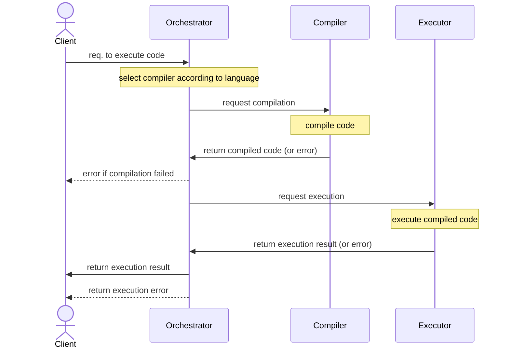

# Codefarem

Codefarem aims to be an online platform that enables teachers to teach their students how
to code in a hands-on environment.

## How it works

Codefarem employs a microservices architecture. Here is a high level sequence diagram of
how it works:

## Motivation

I started this project to teach myself the newest technologies of the web, and as such this
project uses bleeding edge technologies to achieve its goals. Here is a non exhaustive list of
the technologies used:

- [Edgedb][edgedb]: Database for backend
- [Hanko][hanko]: Authentication provider
- [Remix][remix]: Framework used for the main website
- [Next UI][next-ui]: Frontend framework in the main website
- [Vite][vite]: Framework used for the admin website
- [Mantine][mantine]: Frontend framework in admin website
- [Emscripten][emscripten]: Compiling `cpp` to `wasm`
- [Tinygo][tinygo]: Compiling `go` to `wasm`
- [Rust Wasi][rust-wasm32]: Compiling `rs` to `wasm`
- [Wasmtime][wasmtime]: Executing the compiled `wasm` output

[edgedb]: https://edgedb.com
[hanko]: https://hanko.io
[remix]: https://remix.run
[mantine]: https://mantine.dev
[next-ui]: https://nextui.org
[vite]: https://vitejs.dev
[emscripten]: https://emscripten.org
[tinygo]: https://tinygo.org
[rust-wasm32]: https://github.com/bytecodealliance/cargo-wasi
[wasmtime]: https://wasmtime.dev
