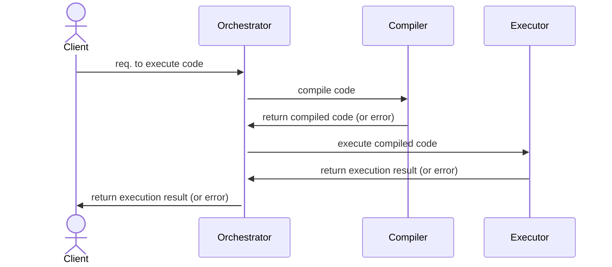

# Codefarem

Codefarem aims to be an online platform that enables teachers to teach their students in a
hands-on fashion.

## How it works

## Motivation

I started this project to teach myself the newest technologies of the web, and as such this
project uses bleeding edge technologies to achieve its goals. Here is a non exhaustive list of
the technologies used:

- [Edgedb][edgedb]: For the database
- [Hanko][hanko]: For the authentication framework
- [Remix][remix]: For the frontend
- [Mantine][mantine]: For the frontend components
- [Empscripten][emscripten]: For the CPP WASM compilation
- [Tinygo][tinygo]: For the Go WASM compilation
- [Rustc Wasm][rustc-wasm32]: For the Rust WASM compilation
- [Wasmtime][wasmtime]: For executing the compiled WASM outputs

[edgedb]: https://edgedb.com
[hanko]: https://hanko.io
[remix]: https://remix.run
[mantine]: https://mantine.dev
[emscripten]: https://emscripten.org
[tinygo]: https://tinygo.org
[rustc-wasm32]: https://github.com/bytecodealliance/cargo-wasi
[wasmtime]: https://wasmtime.dev
